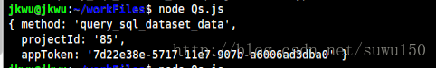
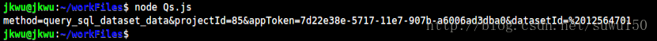

我们进行json格式文件的保存或传输的时候,我们会要求有格式的保存,而不是保存为一整行的内容,这种将对象的状态转化为字符串的形式其实也就是对象的序列化行为

#### QS

定义：是一个npm仓库所管理的包,可通过`npm install qs`命令进行安装.

##### 使用方法

1. qs.parse()将URL解析为对象的类型

   ```js
   const Qs = require('qs');
   let url = 'method=query_sql_dataset_data&projectId=85&appToken=7d22e38e-5717-11e7-907b-a6006ad3dba0';
   Qs.parse(url);
   console.log(Qs.parse(url));
   ```

   [](https://img2018.cnblogs.com/blog/1329237/201906/1329237-20190626100326140-87636850.png)

2. qs.stringify()将对象序列化为URL的形式，用&拼接。

   ```js
   const Qs = require('qs');
   let obj= {
        method: "query_sql_dataset_data",
        projectId: "85",
        appToken: "7d22e38e-5717-11e7-907b-a6006ad3dba0",
        datasetId: " 12564701"
      };
   Qs.stringify(obj);
   console.log(Qs.stringify(obj));
   ```

   

3. 传递数组

   ```js
   // 默认情况下，它们给出明确的索引，如下代码：
   qs.stringify({ a: ['b', 'c', 'd'] });
   // 输出：'a[0]=b&a[1]=c&a[2]=d'
   
   // 也可以进行重写这种默认方式为false
   qs.stringify({ a: ['b', 'c', 'd'] }, { indices: false });
   // 输出：'a=b&a=c&a=d'
   
   //当然，也可以通过arrayFormat 选项进行格式化输出，如下代码所示：
   qs.stringify({ a: ['b', 'c'] }, { arrayFormat: 'indices' })
   // 'a[0]=b&a[1]=c'
   qs.stringify({ a: ['b', 'c'] }, { arrayFormat: 'brackets' })
   // 'a[]=b&a[]=c'
   qs.stringify({ a: ['b', 'c'] }, { arrayFormat: 'repeat' })
   // 'a=b&a=c'
   ```

##### 如何避免options请求

场景：在使用axios的post等方式请求后台数据时，往往会出现两个请求，一个是预请求，方式为options，另外一个为真正的请求方式如post。

options请求的作用：在发送formdata等或者post请求跨域时，如果请求字段超出如下内容，就是**非简单请求**，浏览器就先发option试探服务器是否允许跨域，检验请求的接口是否可以正常访问。

（1) 请求方法是以下三种方法之一：HEAD，GET，POST

（2）HTTP的头信息不超出以下几种字段：

- Accept
- Accept-Language
- Content-Language
- Last-Event-ID
- Content-Type：只限于三个值application/x-www-form-urlencoded、multipart/form-data、text/plain

默认情况下，axios将JavaScript对象序列化为JSON来发送，也就是说会使用 'application/json'作为Content-Type，**请求变得“不简单”了**

解决：qs库是用来发送formdata数据的，并且可以改变数据格式，同时去掉options预请求。

#### JSON

JSON.stringify是js自带的将对象或数组进行序列化的一个工具方法。

#### QS与JSON的stringify方法的区别

都是把对象的类型转换成另外一种类型。

```js
// JSON.stringify(param)进行处理，返回Json格式字符串
{"uid":"cs11","pwd":"000000als","username":"cs11","password":"000000als"}       
// Qs.stringify(param)，返回URL格式字符串
uid=cs11&pwd=000000als&username=cs11&password=000000als                   
```

##### 