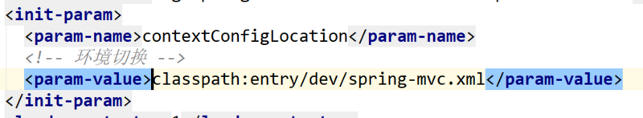

通常在java项目中，classpath用来指定配置/资源文件的路径。classpath就是class的path，也就是类文件(*.class的路径)。

一谈到文件的路径，我们就很有必要了解一个java项目（通常也是web项目）它在真正运行时候，这个项目内部的目录、文件的结构。

## web项目结构

SSMProject

- src
  - main
    - java
    - resources
    - webapp
      - WEB-INF
        - views
        - web.xml
  - text
    - java
- pom.xml

我们在web.xml中指定springmvc的配置文件

当们把*Mapper.xml文件放在了main/java/../mapping/文件夹下时，在mybatis的配置文件中配置其位置

## 发布后的目录结构

SSMProject

- META-INF
- WEB-INF
  - classes
  - lib
  - views
  - web.xml

开发时期的项目里，**src/main/下面的java和resources文件夹都被(编译)打包到了生产包的WEB-INF/classes/目录下**；而**原来WEB-INF下面的views和web.xml则仍然还是在WEB-INF下面**。同时由**maven引入的依赖都被放入到了WEB-INF/lib/下面**。最后，**编译后的class文件和资源文件都放在了classes目录下**。

## classpath

在**编译打包后的项目中**，**根目录是META-INF和WEB-INF** 。**classes**文件夹就是我们要找的**classpath**。

在第1个例子里，classpath:entry/dev/spring-mvc.xml 中，classpath就是指WEB-INF/classes/这个目录的路径。需要声明的一点是，使用**classpath:前缀只能代表一个文件**。

在第2个例子里，classpath*:**/mapper/mapping/*Mapper.xml，使用**classpath\*:前缀可以代表多个匹配的文件**；**/mapper/mapping/*Mapper.xml，**双星号\**表示在任意目录下**，也就是说在WEB-INF/classes/下任意层的目录，只要符合后面的文件路径，都会被作为资源文件找到。

