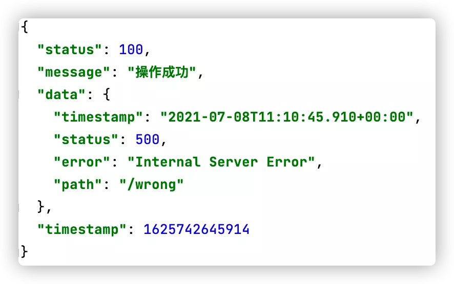

## 为什么要返回统一的标准格式

在默认情况下，SpringBoot的返回格式常见的有三种：

**第一种：返回 String**

```
@GetMapping("/hello")
public String getStr(){
  return "hello,javadaily";
}
```

此时调用接口获取到的返回值是这样：

```
hello,javadaily
```

**第二种：返回自定义对象**

```
@GetMapping("/aniaml")
public Aniaml getAniaml(){
  Aniaml aniaml = new Aniaml(1,"pig");
  return aniaml;
}
```

此时调用接口获取到的返回值是这样：

```
{
  "id": 1,
  "name": "pig"
}
```

**第三种：接口异常**

```
@GetMapping("/error")
public int error(){
    int i = 9/0;
    return i;
}
```

此时调用接口获取到的返回值是这样：

```
{
  "timestamp": "2021-07-08T08:05:15.423+00:00",
  "status": 500,
  "error": "Internal Server Error",
  "path": "/wrong"
}
```

基于以上种种情况，如果你和前端开发人员联调接口她们就会很懵逼，由于我们没有给他一个统一的格式，前端人员不知道如何处理返回值。

还有甚者，有的同学比如小张喜欢对结果进行封装，他使用了Result对象，小王也喜欢对结果进行包装，但是他却使用的是Response对象，当出现这种情况时我相信前端人员一定会抓狂的。

所以我们项目中是需要定义一个统一的标准返回格式的。

## 定义返回标准格式

一个标准的返回格式至少包含3部分：

1. status 状态值：由后端统一定义各种返回结果的状态码
2. message 描述：本次接口调用的结果描述
3. data 数据：本次返回的数据。

```
{
  "status":"100",
  "message":"操作成功",
  "data":"hello,javadaily"
}
```

当然也可以按需加入其他扩展值，比如我们就在返回对象中添加了接口调用时间

1. timestamp: 接口调用时间

### 定义返回对象

```java
@Data
public class ResultData<T> {
  /** 结果状态 ,具体状态码参见ResultData.java*/
  private int status;
  private String message;
  private T data;
  private long timestamp ;


  public ResultData (){
    this.timestamp = System.currentTimeMillis();
  }


  public static <T> ResultData<T> success(T data) {
    ResultData<T> resultData = new ResultData<>();
    resultData.setStatus(ReturnCode.RC100.getCode());
    resultData.setMessage(ReturnCode.RC100.getMessage());
    resultData.setData(data);
    return resultData;
  }

  public static <T> ResultData<T> fail(int code, String message) {
    ResultData<T> resultData = new ResultData<>();
    resultData.setStatus(code);
    resultData.setMessage(message);
    return resultData;
  }

}
```

### 定义状态码

```java
public enum ReturnCode {
    /**操作成功**/
    RC100(100,"操作成功"),
    /**操作失败**/
    RC999(999,"操作失败"),
    /**服务限流**/
    RC200(200,"服务开启限流保护,请稍后再试!"),
    /**服务降级**/
    RC201(201,"服务开启降级保护,请稍后再试!"),
    /**热点参数限流**/
    RC202(202,"热点参数限流,请稍后再试!"),
    /**系统规则不满足**/
    RC203(203,"系统规则不满足要求,请稍后再试!"),
    /**授权规则不通过**/
    RC204(204,"授权规则不通过,请稍后再试!"),
    /**access_denied**/
    RC403(403,"无访问权限,请联系管理员授予权限"),
    /**access_denied**/
    RC401(401,"匿名用户访问无权限资源时的异常"),
    /**服务异常**/
    RC500(500,"系统异常，请稍后重试"),

    INVALID_TOKEN(2001,"访问令牌不合法"),
    ACCESS_DENIED(2003,"没有权限访问该资源"),
    CLIENT_AUTHENTICATION_FAILED(1001,"客户端认证失败"),
    USERNAME_OR_PASSWORD_ERROR(1002,"用户名或密码错误"),
    UNSUPPORTED_GRANT_TYPE(1003, "不支持的认证模式");


    /**自定义状态码**/
    private final int code;
    /**自定义描述**/
    private final String message;

    ReturnCode(int code, String message){
        this.code = code;
        this.message = message;
    }


    public int getCode() {
        return code;
    }

    public String getMessage() {
        return message;
    }
}
```

### 统一返回格式

```
@GetMapping("/hello")
public ResultData<String> getStr(){
 return ResultData.success("hello,javadaily");
}
```

此时调用接口获取到的返回值是这样：

```
{
  "status": 100,
  "message": "hello,javadaily",
  "data": null,
  "timestamp": 1625736481648,
  "httpStatus": 0
}
```

这样确实已经实现了我们想要的结果，我在很多项目中看到的都是这种写法，在Controller层通过`ResultData.success()`对返回结果进行包装后返回给前端。

看到这里我们不妨停下来想想，这样做有什么弊端呢？

**最大的弊端就是我们后面每写一个接口都需要调用** **`ResultData.success()`** **这行代码对结果进行包装，重复劳动，浪费体力；

### 高级实现方式

我们只需要借助SpringBoot提供的`ResponseBodyAdvice`,优化代码，目标就是不要每个接口都手工制定`ResultData`返回值。

ResponseBodyAdvice的作用：拦截Controller方法的返回值，统一处理返回值/响应体，一般用来统一返回格式，加解密，签名等等。

先来看下`ResponseBodyAdvice`的源码：

```
public interface ResponseBodyAdvice<T> {
  /**
  * 是否支持advice功能
  * true 支持，false 不支持
  */
    boolean supports(MethodParameter var1, Class<? extends HttpMessageConverter<?>> var2);

   /**
  * 对返回的数据进行处理
  */
    @Nullable
    T beforeBodyWrite(@Nullable T var1, MethodParameter var2, MediaType var3, Class<? extends HttpMessageConverter<?>> var4, ServerHttpRequest var5, ServerHttpResponse var6);
}
```

我们只需要编写一个具体实现类即可

```
/**
 * @author jam
 * @date 2021/7/8 10:10 上午
 */
@RestControllerAdvice
public class ResponseAdvice implements ResponseBodyAdvice<Object> {
    @Autowired
    private ObjectMapper objectMapper;

    @Override
    public boolean supports(MethodParameter methodParameter, Class<? extends HttpMessageConverter<?>> aClass) {
        return true;
    }

    @SneakyThrows
    @Override
    public Object beforeBodyWrite(Object o, MethodParameter methodParameter, MediaType mediaType, Class<? extends HttpMessageConverter<?>> aClass, ServerHttpRequest serverHttpRequest, ServerHttpResponse serverHttpResponse) {
        if(o instanceof String){
            return objectMapper.writeValueAsString(ResultData.success(o));
        }        
        return ResultData.success(o);
    }
}
```

- 需要注意两个地方：

`@RestControllerAdvice`注解`@RestControllerAdvice`是`@RestController`注解的增强，可以实现三个方面的功能：

1.全局异常处理

2.全局数据绑定

3.全局数据预处理

- String类型判断

```
if(o instanceof String){
  return objectMapper.writeValueAsString(ResultData.success(o));
} 
```

这段代码一定要加，如果Controller直接返回String的话，SpringBoot是直接返回，故我们需要手动转换成json。

经过上面的处理我们就再也不需要通过`ResultData.success()`来进行转换了，直接返回原始数据格式，SpringBoot自动帮我们实现包装类的封装。

```
@GetMapping("/hello")
public String getStr(){
    return "hello,javadaily";
}
```

此时我们调用接口返回的数据结果为：

```
{
  "status": 100,
  "message": "操作成功",
  "data": "hello,javadaily",
  "timestamp": 1626427373113
}
```

### 接口异常问题 

此时有个问题，由于我们没对Controller的异常进行处理，当我们调用的方法一旦出现异常，就会出现问题，比如下面这个接口

```
@GetMapping("/wrong")
public int error(){
    int i = 9/0;
    return i;
}
```

返回的结果为：



这显然不是我们想要的结果，接口都报错了还返回操作成功的响应码，前端看了会打人的。

别急，接下来我们进入第二个议题，如何优雅的处理全局异常。

## 什么需要全局异常处理器

1.不用手写try...catch，由全局异常处理器统一捕获

使用全局异常处理器最大的便利就是程序员在写代码时不再需要手写`try...catch`了，前面我们讲过，默认情况下SpringBoot出现异常时返回的结果是这样：

```
{
  "timestamp": "2021-07-08T08:05:15.423+00:00",
  "status": 500,
  "error": "Internal Server Error",
  "path": "/wrong"
}
```

这种数据格式返回给前端，前端是看不懂的，所以这时候我们一般通过`try...catch`来处理异常

```
@GetMapping("/wrong")
public int error(){
    int i;
    try{
        i = 9/0;
    }catch (Exception e){
        log.error("error:{}",e);
        i = 0;
    }
    return i;
}
```

我们追求的目标肯定是不需要再手动写`try...catch`了，而是希望由全局异常处理器处理。

1. 对于自定义异常，只能通过全局异常处理器来处理

```
@GetMapping("error1")
public void empty(){
 throw  new RuntimeException("自定义异常");
}
```

1.当我们引入Validator参数校验器的时候，参数校验不通过会抛出异常，此时是无法用`try...catch`捕获的，只能使用全局异常处理器。

SpringBoot集成参数校验请参考这篇文章SpringBoot开发秘籍 - 集成参数校验及高阶技巧

### 如何实现全局异常处理器

```
@Slf4j
@RestControllerAdvice
public class RestExceptionHandler {
    /**
     * 默认全局异常处理。
     * @param e the e
     * @return ResultData
     */
    @ExceptionHandler(Exception.class)
    @ResponseStatus(HttpStatus.INTERNAL_SERVER_ERROR)
    public ResultData<String> exception(Exception e) {
        log.error("全局异常信息 ex={}", e.getMessage(), e);
        return ResultData.fail(ReturnCode.RC500.getCode(),e.getMessage());
    }

}
```

有三个细节需要说明一下：

1.`@RestControllerAdvice`，RestController的增强类，可用于实现全局异常处理器

2.`@ExceptionHandler`,统一处理某一类异常，从而减少代码重复率和复杂度，比如要获取自定义异常可以`@ExceptionHandler(BusinessException.class)`

3.`@ResponseStatus`指定客户端收到的http状态码

### 体验效果

这时候我们调用如下接口：

```
@GetMapping("error1")
public void empty(){
    throw  new RuntimeException("自定义异常");
}
```

返回的结果如下：

```
{
  "status": 500,
  "message": "自定义异常",
  "data": null,
  "timestamp": 1625795902556
}
```

基本满足我们的需求了。

但是当我们同时启用统一标准格式封装功能`ResponseAdvice`和`RestExceptionHandler`全局异常处理器时又出现了新的问题：

```
{
  "status": 100,
  "message": "操作成功",
  "data": {
    "status": 500,
    "message": "自定义异常",
    "data": null,
    "timestamp": 1625796167986
  },
  "timestamp": 1625796168008
}
```

此时返回的结果是这样，统一格式增强功能会给返回的异常结果再次封装，所以接下来我们需要解决这个问题。

### 全局异常接入返回的标准格式

要让全局异常接入标准格式很简单，因为全局异常处理器已经帮我们封装好了标准格式，我们只需要直接返回给客户端即可。

```
@SneakyThrows
@Override
public Object beforeBodyWrite(Object o, MethodParameter methodParameter, MediaType mediaType, Class<? extends HttpMessageConverter<?>> aClass, ServerHttpRequest serverHttpRequest, ServerHttpResponse serverHttpResponse) {
  if(o instanceof String){
    return objectMapper.writeValueAsString(ResultData.success(o));
  }
  if(o instanceof ResultData){
    return o;
  }
  return ResultData.success(o);
}
```

关键代码：

```
if(o instanceof ResultData){
  return o;
}
```

如果返回的结果是ResultData对象，直接返回即可。

这时候我们再调用上面的错误方法，返回的结果就符合我们的要求了。

```
{
  "status": 500,
  "message": "自定义异常",
  "data": null,
  "timestamp": 1625796580778
}
```